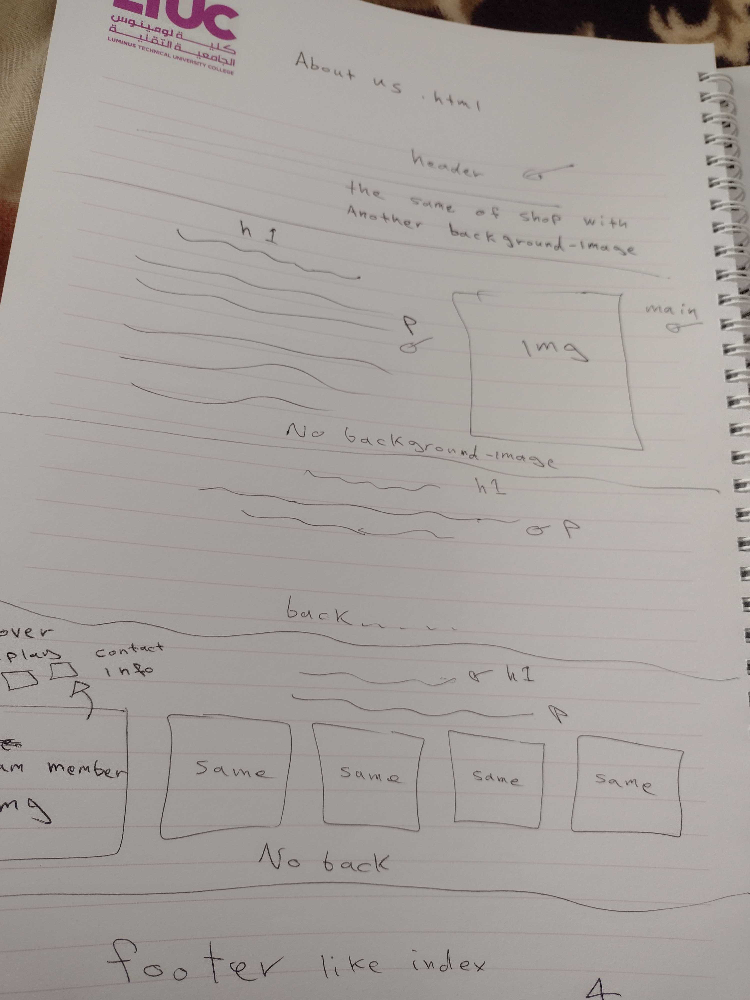
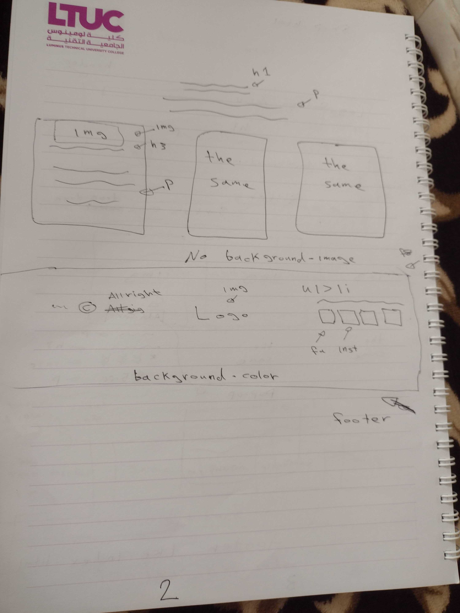

# The requirements

.
.
.
.

## User Stories

1. The user go to the shop page and search for the product and add it to cart.
2. The user signup in the website to get a daily feed.
3. The user changed his miand on a product and go to curt and delete the order.
4. The user is learning  about the Website and gathering information about the people how own the sit.